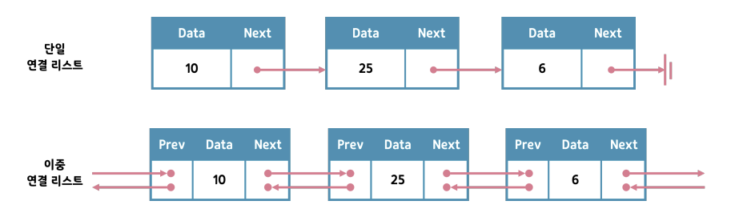

# Array
- A collection of (same-type) "value"s in order

# Linked List
- A collection of "value"s arranged in a linear(unidirectional)
- `Node` : Linked List를 이루는 각 개체
    ||push()|append()|insert()|nodeAt|
    |:-:|:-:|:-:|:-:|:-:|
    |Behavior|insert at head|insert at tail|insert after a node|returns a node at given index|
    |Time Complexity|$O(1)$|$O(1)$|$O(1)$|$O(i)$, where i is the given index|

    ||pop()|removeLast()|removeAfter()|
    |:-:|:-:|:-:|:-:|
    |Behavior|remove at head|remove at tail|remove the immediate next node|
    |Time Complexity|$O(1)$|$O(n)$|$O(1)$|

    1. `push()` : 맨 앞에 노드 삽입(Head-first insertion)
        - `Method Chaining` : 한 줄의 코드에서 여러 메서드를 연속적으로 호출하는 기술
            - 반환 형식을 해당 클래스의 이름으로 지정
            - return this
    1. `append()` : 맨 뒤에 노드 추가(Tail-end insertion)
    1. `nodeAt()` : 주어진 index번 째에 위치하는 노드 객체 반환
    1. `insert()` : 임의의 위치에 노드 추가
        - 임의의 노드를 찾은 뒤 해당 노드 뒤쪽 위치에 새로운 노드 추가  
    1. `pop()` : 맨 앞의 노드 제거
    1. `removeLast()` : 맨 뒤의 노드 제거
        - `?:`(엘비스 연산자)
            - expr1 ?: expr2 구조 가짐
                1. expr1 == null, expr2 반환
                1. expr1 != null, expr1 반환

    1. `removeAfter()` : 

    ```kt
    // Node.kt
    data class Node<T>(
        // 현재 노드의 값
        var value: T,
        // 다음 노드를 가리키는 링크
        var next: Node<T>? = null
    ){
        override fun toString(): String{
            return if(next != null) {
                // 재귀적으로 호출
                "$value -> ${next.toString()}"
            } else { // 마지막 노드인 경우
                "$value"
            }
        }
    }

    // LinkedList.kt
    class LinkedList<T>{
        private var head: Node<T>? = null
        private var tail: Node<T>? = null
        private var size = 0

        fun isEmpty(): Boolean{
            return size == 0
        }

        override fun toString(): String{
            if(isEmpty()){
                return "Empty list"
            }
            return head.toString()
        }

        // Head-first insertion: 리스트의 가장 앞에 item 추가
        // push().push()와 같은 방식을 이용하기 위해 반환 형식을 LinkedList<T>로 지정
        fun push(value: T): LinkedList<T>{
            head = Node(value = value, next = head)
            if(tail == null){
                tail = head
            }
            size++
            // 현재 instance 반환
            return this
        }

        // Tail-end insertion
        // append().append()와 같은 방식을 이용하기 위해 반환 형식을 LinkedList<T>로 지정
        fun append(value: T): LinkedList<T>{
            // LinkedList가 비어 있는 경우
            if(isEmpty()){
                push(value)
                // 현재 instance 반환
                return this
            }

            // LinkedList가 비어 있지 않는 경우
            // 새로운 노드 형성하고 현재 tail 노드의 다음 노드로 설정
            tail?.next = Node(value = value)

            // 새로운 노드를 tail 노드로 업데이트
            tail = tail?.next
            size++
            // 현재 instance 반환
            return this
        }

        // 주어진 index번 째에 위치하는 노드 객체 반환
        fun nodeAt(index: Int): Node<T>?{
            var currentNode = head
            var currentIndex = 0

            while(currentNode != null && currentIndex < index){
                currentNode = currentNode.next
                currentIndex++
            }
            return currentNode
        }    

        // value값을 가진 노드를 afterNode 뒤에 삽입
        fun insert(value: T, afterNode: Node<T>):Node<T>{
            // afterNode가 마지막 노드일 경우
            if(tail == afterNode){
                append(value)
                return tail!!
            }

            // value값을 가진 노드를 생성하고 해당 노드의 다음 노드를 다음 수행에서 afterNode가 되도록 설정 
            val newNode = Node(value = value, next = afterNode.next)

            // 삽입하려는 노드를 afterNode 뒤에 이어줌
            afterNode.next = newNode
            size++
            return newNode
        }   

        // 맨 앞에 위치한 node 제거 & 해당 값 리턴
        fun pop(): T?{
            // 연결 리스트가 비어있지 않을 경우
            if(!isEmpty()) size --

            // head의 value을 result에 저장
            val result = head?.value
            // head를 다음 노드로 설정
            head = head?.next

            // 연결 리스트가 비어 있을 경우
            if(isEmpty()){
                tail = null
            }
            return result
        } 

        // 맨 뒤에 위치한 node 제거 & 해당 값 리턴
        fun removeLast(): T?{
            // head가 null이 아닐 경우, head에 복사
            // head가 null일 경우, null 반환하고 함수 종료
            val head = head ?: return null

            // 노드가 하나만 존재할 경우
            if(head.next == null) return pop()

            size--

            // loop 수행할 세 변수 초기화
            var prev = head
            var current = head
            var next = current.next
            // 리스트의 마지막 노드에 도달할 때까지 반복
            // current가 마지막 노드임
            while(next != null){
                prev = current
                current = next
                next = current.next
            }
            
            // current를 끊어냄
            prev.next = null
            // prev가 마지막 노드가 됨
            tail = prev
            return current.value
        }

        // 임의의 위치의 노드 삭제 & 해당 값 리턴
        // 인덱스 - 1 번째의 뒷 노드 삭제
        fun removeAfter(node: Node<T>): T?{
            // 삽입할 노드 생성
            val result = node.next?.value

            // 삭제할 노드가 마지막 노드인 경우
            if(node.next == tail){
                tail = node
            }

            // node 뒤에 노드가 있는 경우
            if(node.next != null){
                size--
            }

            // node 뒤에 노드가 있는 경우, 삭제한 노드 뒤의 노드와 연결
            // node 뒤에 노드가 없는 경우, null
            node.next = node.next?.next
            return result
        }

    }

    // Main.kt
    fun main(){
        // push()
        val list1 = LinkedList<Int>()
        list1.push(10)
        list1.push(20)
        list1.push(30)
        // 위 세 줄 코드와 동일한 결과 출력
        // list1.push(10).push(20).push(30)
        // push한 역순으로 출력됨
        println(list1) // 출력 : 30 -> 20 -> 10


        // append()
        val list2 = LinkedList<Int>()
        list2.append(10)
        list2.append(20)
        list2.append(30)
        // 위 세 줄 코드와 동일한 결과
        // list2.append(10).append(20).append(30)
        println(list2) // 출력 : 10 -> 20 -> 30


        // nodeAt()
        val list3 = LinkedList<Int>()
        list3.append(10).append(20).append(30)
        println(list3) // 출력 : 10 -> 20 -> 30
        println(list3.nodeAt(2)) // 출력 : 30
        println(list3.nodeAt(3)) // 출력 : null
    

        // insert()
        val list4 = LinkedList<Int>()
        list4.append(10).append(20).append(30)
        // 출력 : Before inserting: 10 -> 20 -> 30
        println("Before inserting: $list4")
        var middleNode = list4.nodeAt(1)!!
        for(i in 1..3){
            middleNode = list4.insert(-1*i, middleNode)
        }
        // 출력 : After inserting: 10 -> 20 -> -1 -> -2 -> -3 -> 30
        println("After inserting: $list4")


        // pop()
        val list5 = LinkedList<Int>()
        var poppedValue = list5.pop()
        println(poppedValue)                   // 출력 : null
        list5.append(10).append(20).append(30)
        println("Before popping list: $list5") // 출력 : Before popping list: 10 -> 20 -> 30
        poppedValue = list5.pop()              
        println("After popping list: $list5")  // 출력 : After popping list: 20 -> 30
        println("Popped value: $poppedValue")  // Popped value: 10 


        // removeLast()
        val list6 = LinkedList<Int>()
        list6.append(10).append(20).append(30)
        println("Before removing last node: $list6") // 출력 : Before removing last node: 10 -> 20 -> 30
        val removedValue = list6.removeLast()
        println("After removing last node: $list6")  // 출력 : After removing last node: 10 -> 20
        println("Removed Value: $removedValue")      // 출력 : Removed Value: 30


        // removeAfter()
        val list7 = LinkedList<Int>()
        list7.append(10).append(20).append(30)
        println("Before removing at particular index: $list7") // 출력 : Before removing at particular index: 10 -> 20 -> 30
        val index = 1
        val node = list7.nodeAt(index - 1)!!
        val removedValue = list7.removeAfter(node)
        println("After removing at index: $list7")             // 출력 : After removing at index: 10 -> 30
        println("Removed Value: $removedValue")                // 출력 : Removed Value: 20

    }
    ```

## Array VS. Linked List
||Array|Linked Lists|
|:-:|:-:|:-:|
|Storage Method|in contiguous location|not in contiguous location|
|size|Fixed|Dynamic|
|Memory Allocation Time|at compile time|at run time|
|Memory Usage Level|$\downarrow$(elemnets)|$\uparrow$(data and the address of next node)|
|Access to Elements|index|the traversal of whole linked list|
|Manipulation of Elements|Insersion and deletion operation takes time|Insersion and deletion operation is faster|


- removeAt(Int)의 시간 복잡도는? $O(n)$
    - 배열 : 특정 인덱스의 요소 삭제할 때, 삭제된 인덱스 이후의 모든 요소를 한 칸씩 앞으로 이동시켜야 함  
 
- 배열에서의 push()의 시간 복잡도는? $O(n)$
    - push()는 맨 앞에 노드 추가하는 작업 수행
    - 배열에서 맨 앞에 노드 추가 후 반드시 기존 요소를 한 칸씩뒤로 이동시키는 작업 필요 $\Rightarrow$ 시간복잡도는 기존 배열의 크기에 비례하여 이루어짐


## Linked List 개량하기
### Motivation: LinkedList 객체의 각 item의 2배 값 출력
    ```kt
    // Main.kt
    fun main(){
        val list = LinkedList<Int>()
        list.push(3)
        list.push(2)
        list.push(1)
        println(list) // 출력 : 1 -> 2 -> 3

        var the_node = list.nodeAt(0)!!
        // 출력 : 2 -> 4 -> 6
        while(true){
            print(the_node.value * 2)
            if(the_node.next != null){
                print(" -> ")
                the_node = the_node.next!!
            }
            else{
                break
            }
        }
    }
    ```
### Iterable 인터페이스 사용하여 개량
```kt
// 개선 코드

// LinkedList.kt
// LinkedList 클래스는 Iterable 인터페이스 상속
// Iterable 인터페이스 : 컬렉션이 반복 가능한 객체로 동작할 수 있도록 하는 표준 Kotlin 인터페이스
class LinkedList<T>: Iterable<T>{
    private var head: Node<T>? = null
    private var tail: Node<T>? = null
    var size = 0
        // 외부에서 직접 수정 불가
        private set // read only

    // iterator() : Iterable 인터페이스의 추상 메서드
    // Iterator() : 실제 컬렉션을 반복하는데 사용되는 객체
    override fun iterator(): Iterator<T>{
        return LinkedListIterator(this)
    }

                    .
                    .
                    .
}

// Iterator 인터페이스: hasNext() 함수, next() 함수 정의
// hasNext() : 다음 요소가 존재하는지 여부를 확인
// next() : 다음 요소 반환
class LinkedListIterator<K>(
    private val list: LinkedList<K>
): Iterator<K>{
    private var index = 0
    private var lastNode: Node<K>? = null

    override fun next(): K{
        // 모든 요소를 이미 반복했거나 리스트가 비어있는 경우
        if(index >= list.size) throw IndexOutOfBoundsException()
        
        lastNode = if(index == 0){
            list.nodeAt(0)
        }else{
            lastNode?.next
        }

        index++
        return lastNode!!.value
    }
    override fun hasNext(): Boolean{
        return index < list.size
    }
}


// Main.kt
fun main(){
    val list = LinkedList<Int>()
    list.push(3)
    list.push(2)
    list.push(1)
    println(list) // 출력 : 1 -> 2 -> 3

    var s: String = ""
    // item의 자료형은 Int
    // LinkedList<Int>를 반복하고 있으며, LinkedListIterator 클래스는 LinkedList<Int>를 구현하기에
    for (item in list)
        s += " -> ${item * 3}"
    s = s.substring(4) // 맨 처음 4개 문자 " -> " 지움
    println(s) // 출력 : 3 -> 6 -> 9
}
```

### Collection 인터페이스 사용하여 개량
- `Collection`  
    - Collection은 Iterable도 포함 $\Rightarrow$ Collection만 상속 받아도 됨
    - `size` 변수, `isEmpty()`를 포함하는 Interface $\Rightarrow$ 해당 변수 또는 함수 앞에 `override` 붙여야 함
```kt
// LinkedList.kt
// Collection 인터페이스 : Iterable 포함 -> Iterable<T> 부분은 안 써도 됨
//                       size 변수, isEmpty() 포함 -> 이들 앞에 override 써줘야 함
class LinkedList<T>: Iterable<T>, Collection<T>{
    private var head: Node<T>? = null
    private var tail: Node<T>? = null
    override var size = 0 // Collection에 포함되는 변수
        private set // read only

    override fun iterator(): Iterator<T>{
        return LinkedListIterator(this)
    }

    override fun isEmpty(): Boolean{ // Collection에 포함되는 함수
        return size == 0
    }

    // 새롭게 추가된 override 함수들
    // contains의 시간복잡도 : O(n)
    // containsAll의 시간복잡도 : O(n^2), contains()를 반복하고 있기에
    override fun contains(element: T): Boolean{
        for (item in this)
            if (item == element) return true
        return false
    }
    override fun containsAll(elements: Collection<T>): Boolean{
        for(searched in elements)
            if(!contains(searched)) return false
        return true
    }

                        .
                        .
                        .
}


// Main.kt
fun main(){
    val list = LinkedList<Int>()
    list.push(3)
    list.push(2)
    list.push(1)

    var list2 = LinkedList<Int>()
    list2.append(2).append(3)

    println(list.containsAll(list2)) // 출력 : true
}
```

### Doubly Linked List

- Doubly Linked List
    - 장단점
        - 장점 : 노드 탐색 시 걸리는 시간 단축 가능
        - 단점 : 메모리 공간이 추가적으로 필요
    - 원형(환형)으로 제작 가능
        - 사실상 head와 tail의 구분이 없음
        - 임의의 노드부터 시작하여 모든 노드로 접근 가능

### printInReverse()
- 노드들을 역순으로 출력
- 해당 함수의 시간복잡도 : $O(n)$
- 코드 실행 순서
    1. main()의 list.printInReverse()
        - list의 타입인 LinkedList<Int> 객체의 printInReverse 실행됨
    1. LinkedList 클래스의 printInReverse() 
        - this.nodeAt(0)?.printInReverse()
    1. this.nodeAt(0)의 반환형은 Node<T>
        - this.nodeAt(0)?.printInReverse()에서의 printInReverse()는 Node<T> 클래스의 내장함수
```kt
// Node.kt
data class Node<T>(
    var value: T,
    var next: Node<T>? = null
){
    override fun toString(): String{
        return if(next != null) {
            "$value -> ${next.toString()}"
        } else {
            "$value"
        }
    }
    
    // 추가된 함수
    fun printInReverse(){
        // printInReverse()을 재귀적으로 호출
        this.next?.printInReverse()
        
        // 마지막 노드가 아닐 경우
        if(this.next != null){
            print(" -> ")
        }
        
        // 아래 코드의 toString() != Node 클래스의 내장함수 toString()
        print(this.value.toString())
    }
}


// LinkedList.kt
class LinkedList<T>: Collection<T>{
                .
                .
                .

    fun printInReverse(){
        this.nodeAt(0)?.printInReverse()
    }
}

// Main.kt
fun main(){
    val list = LinkedList<Int>()
    list.append(1)
    list.append(2)
    list.append(3)
    list.append(4)
    list.append(5)
    println(list)         // 출력 : 1 -> 2 -> 3 -> 4 -> 5
    list.printInReverse() // 출력 : 5 -> 4 -> 3 -> 2 -> 1
}
```

### getMiddle()
- 순서 상 가운데에 위치한 item 출력
- 해당 함수의 시간복잡도 : $O(n)$
- 토끼와 거북이 알고리즘과 유사
    - fast 포인터는 한 번에 두 단계씩 이동
    - slow 포인터는 한 번에 한 단계씩 이동
    - fast 포인터가 리스트 끝에 도달할 때까지 반복
    - fast 포인터가 리스트 끝에 도달 == slow 포인터가 리스트의 중간 노드에 위치
```kt
// LinkedList.kt
class LinkedList<T>: Collection<T>{
                .
                .
                .
    // 토끼와 거북이 알고리즘과 유사
    fun getMiddle(): Node<T>?{
        var slow = this.nodeAt(0)
        var fast = this.nodeAt(0)
        
        while(fast != null){
            fast = fast.next
            if(fast != null){
                fast = fast.next
                slow = slow?.next
            }
        }
        return slow
    }

}


// Main.kt
fun main(){
    val list = LinkedList<Int>()
    list.append(1)
    list.append(2)
    list.append(3)
    list.append(4)
    list.append(5)
    println(list)                    // 출력 : 1 -> 2 -> 3 -> 4 -> 5
    println(list.getMiddle()?.value) // 출력 : 3
}
```


### reversed()
- item들을 역순으로 가지는 새로운 LinkedList 생성
- 해당 함수의 시간복잡도 : $O(n)$
```kt
// LinkedList.kt
class LinkedList<T>: Collection<T>{
                .
                .
                .
    private fun addInReverse(list: LinkedList<T>, node: Node<T>){
        val next = node.next

        if(next != null){
            // 재귀적으로 호출
            addInReverse(list, next)
        }
        
        // 새로운 리스트에 노드 삽입
        list.append(node.value)
    }

    fun reversed(): LinkedList<T>{
        // 새로운 링크드 리스트 생성
        val result = LinkedList<T>()

        val head = this.nodeAt(0)
        if(head != null){
            addInReverse(result, head)
        }
        return result
    }
}


// Main.kt
fun main(){
    val list = LinkedList<Int>()
    list.append(1)
    list.append(2)
    list.append(3)
    list.append(4)
    list.append(5)

    println("Original: $list")              // 출력 : 1 -> 2 -> 3 -> 4 -> 5
    println("Reversed: ${list.reversed()}") // 출력 : 5 -> 4 -> 3 -> 2- > 1
}
```

### mergeSorted()
- 객체 A와 객체 B에 대하여, 객체 B의 item들 사이에서 객체 A의 item들을 적절한 위치에 삽입한 새로운 Linked List를 반환
- 해당 함수의 시간복잡도 : $O(m + n)$
    - m: # of nodes (this)
    - n: # of nodes (otherList)
```kt
// LinkedList.kt
class LinkedList<T>: Collection<T>{
                .
                .
                .

    // 기존에 존재하던 append() 함수와 이름은 동일하지만
    // 전혀 다른 매개변수를 가진 함수를 추가로 정의 가능
    private fun append(
        result: LinkedList<T>,
        node: Node<T>
    ): Node<T>?{
        result.append(node.value)
        return node.next
    }
                .
                .
                .

    fun mergeSorted(
        otherList: LinkedList<T>
    ): LinkedList<T>{
        // this가 빈 링크드 리스트일 경우
        if(this.isEmpty()) return otherList

        // other이 빈 링크드 리스트일 경우
        if(otherList.isEmpty()) return this

        val result = LinkedList<T>()
        // left는 this의 head를 가리킴
        var left = nodeAt(0)
        // right는 other의 head를 가리킴
        var right = otherList.nodeAt(0)

        while(left != null && right != null){
            if((left.value as Int) < (right.value as Int)){
                left = append(result, left)
            }
            else{
                right = append(result, right)
            }
        }

        while(left != null){
            left = append(result, left)
        }

        while(right != null){
            right = append(result, right)
        }

        return result
    }
}


// Main.kt
fun main(){
    val list = LinkedList<Int>()
    list.append(1)
    list.append(2)
    list.append(3)
    list.append(4)
    list.append(5)

    val other = LinkedList<Int>()
    other.append(-1)
    other.append(-2)
    other.append(-3)
    other.append(-4)
    other.append(-5)

    println("Left: $list")   // 출력 : 1 -> 2 -> 3 -> 4 -> 5
    println("Right: $other") // 출력 : -1 -> -2 -> -3 -> -4 -> -5
    println("Merged: ${list.mergeSorted(other)}") // 출력 : Merged: -1 -> -2 -> -3 -> -4 -> -5 -> 1 -> 2 -> 3 -> 4 -> 5
}
```

